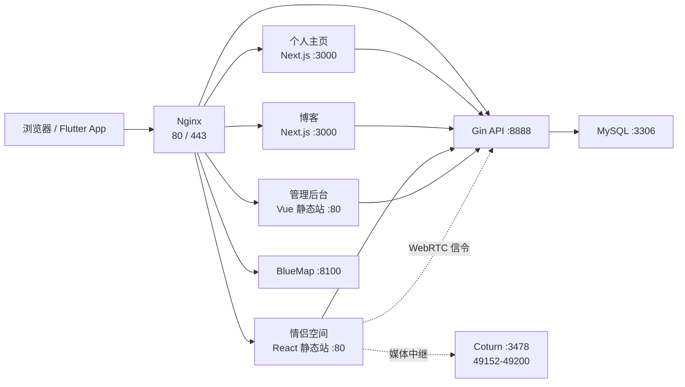

# 系统架构与服务边界

## 总体结构

生产环境中只有 Nginx 的 `80/443` 和 Coturn 所需端口需要公网访问。MySQL、后端及各 Web 容器只在 Compose 网络内通信。

## 服务清单

| Compose 服务 | 容器内端口 | 生产公网入口 | 持久化数据 |
| --- | ---: | --- | --- |
| `mysql` | 3306 | 无 | `mysql_data/` |
| `gva-server` | 8888 | 经 `/api/`、`/uploads/`、`/swagger/` 代理 | `uploads/`、`logs/` |
| `home-web` | 3000 | `xiaoyu.ski`、`home.xiaoyu.ski` | 无 |
| `blog-frontend` | 3000 | `blog.xiaoyu.ski` | 无 |
| `duo-call-web` | 80 | `ai.xiaoyu.ski` | 无 |
| `admin-web` | 80 | `ht.xiaoyu.ski` | 无 |
| `bluemap` | 8100 | `map.xiaoyu.ski` | `bluemap/config/`、`data/`、`web/`、`active-world/` |
| `coturn` | 3478、49152-49200 | `turn.xiaoyu.ski` | 无 |
| `gva-web` | 80、443 | 所有 HTTPS 站点 | TLS 证书来自宿主机 |
| `watchtower` | 无 | 无 | Docker 登录凭据只读挂载 |

## 入口路由

| Host 或路径 | 上游 |
| --- | --- |
| `xiaoyu.ski/*`、`home.xiaoyu.ski/*` | `home-web:3000` |
| `blog.xiaoyu.ski/*` | `blog-frontend:3000` |
| `ai.xiaoyu.ski/*` | `duo-call-web:80` |
| `ht.xiaoyu.ski/*` | `admin-web:80` |
| `map.xiaoyu.ski/*` | `bluemap:8100` |
| 任一应用站点的 `/api/*` | `gva-server:8888` |
| `xiaoyu.ski/api/bc/chat` | `home-web` 的流式聊天接口 |
| `ai.xiaoyu.ski/api/duoCall/ws` | 后端 WebSocket 信令 |
| `/uploads/*`、`/swagger/*` | 后端上传文件和 Swagger |

静态资源由 Nginx 设置长缓存；上传文件只设置一小时缓存。修改静态文件名或缓存策略时应同时检查前端构建产物是否带内容哈希。

## 数据与状态

- MySQL 是笔记、后台、博客配置和情侣空间业务数据的主存储。
- `uploads/` 保存后端本地对象存储文件。
- `logs/` 是后端运行日志，不是文档目录。
- BlueMap 的世界、切片和 Web 数据均来自挂载目录，镜像只提供 Java 运行环境。
- 情侣通话的信令走后端 WebSocket，音视频优先点对点，失败时使用 Coturn 中继。
- 微信测试号推送由后端定时任务处理，数据库中的站内记录才是最终数据来源。

## 代码与部署边界

生产 Compose 默认拉取阿里云 ACR 的预构建业务镜像；MySQL、Nginx、Coturn、Watchtower 使用公共镜像。Flutter App 不在 Docker Compose 内，需要单独打包并通过 `BASE_URL` 指向公开 API 网关。
